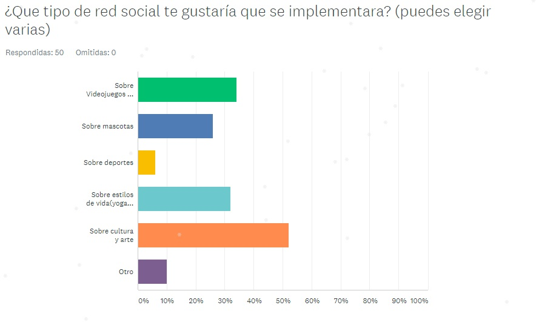

# Artgram
## Desarrollado para [Laboratoria](www.laboratoria.la)

* **Track:** _Common Core_
* **Curso:** _Crea tu propia red social_
* **Unidad:** _Producto final_

***

## Proceso

Para este proyecto se lanzó una ecnuesta para la cual los usuarios seleccionaban la temátucade la red social ya que lo más importante era el poder ofrecer algo de mayor relevancia para ellos.

Está encuesta se dejo actiba durante 24 horas para poder recabar la mayor catidad de datosposible, los resultados mostraron que la mayoría de nuestros encuestados preperían una red social de cultura y arte como se muestra a continuación.

posteriormente de que nuestros futuros usuarios seleccionaron la temática nos dedicamos a hacer una planeación de lo que contendría nuestra red social,; así como también los mpetodos que se usarían en esta para arle funcionalidad alproducto.

## Estructura de HTML:

1. Nuestra web esta conformada por varios HTML:

  1. **Index** Contiene el log inde la página

  2. **Principal** Contiene los elemets que aparecerán en el newsfeed de amigos donde tambien se podrán hacer comentarios a las publicaciones de los amigos

  3. **Perfil** Es lapáfina quecontendrá nuestro perfil de usario así como nuestras propias publicaciones

## Desarrollo del proyecto

Para este producto final se analizo lo que las personas desean ver en internet, asi que se busco que el usuario tuviera una experiecniaagradableal usar la aplicación

**Primero**

Se realizará el maquetado de la vista de amigos junto co  el maquetado de el login,después se continuarácon el maquetado de las demas vistas

**Posteriormente**

Se buscará la fucnionalidad de JS de los comentarios y que se puedan publicar.

Mientras que se buscará la funcionalidad del login haciendo uso de Firebase

**Por último**

Se buscará todas las demás funcionalidades del proyecto como lo son el publicar imágenes,agregar amigos,etc.

